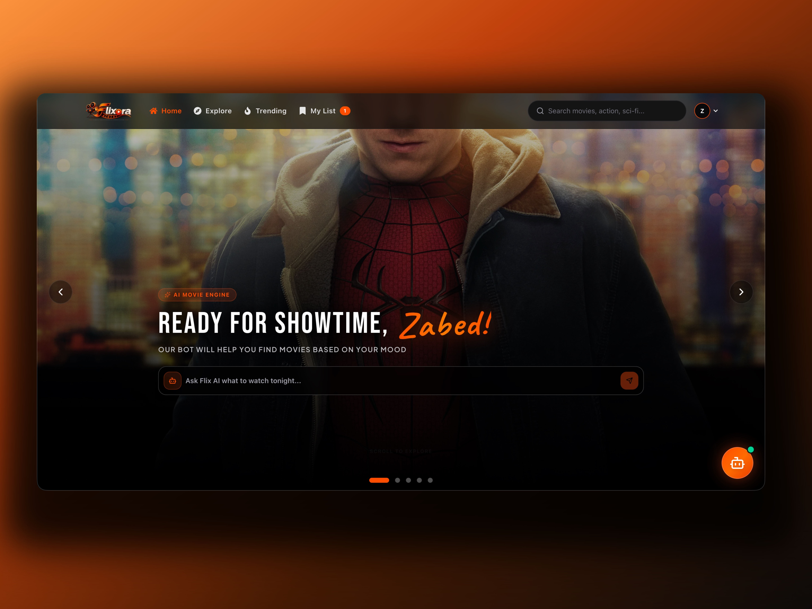
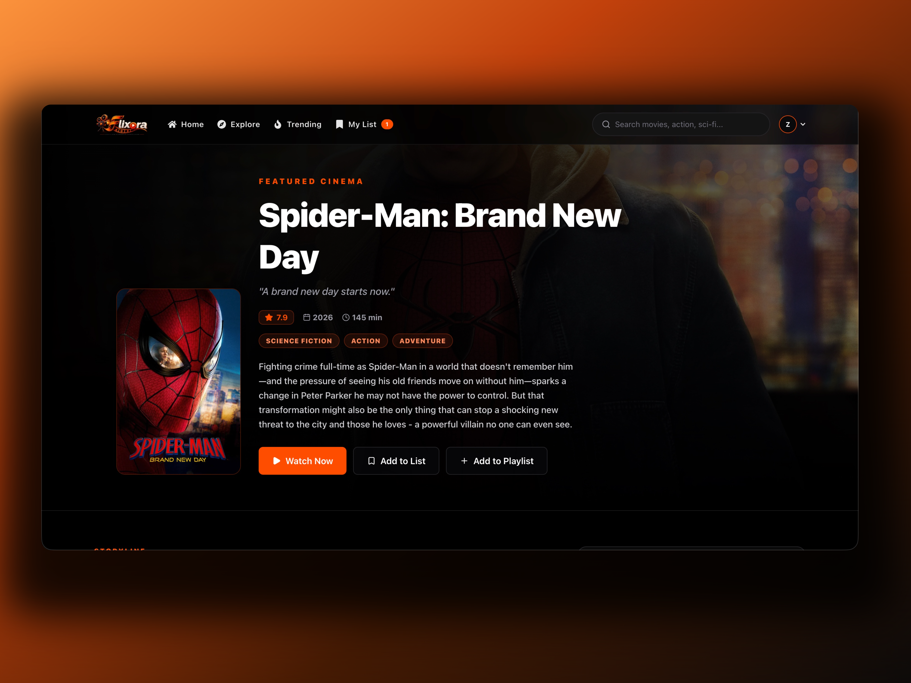
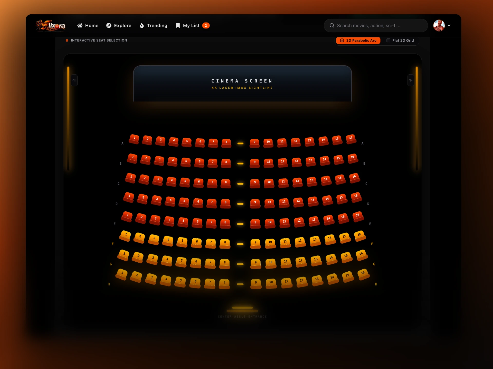
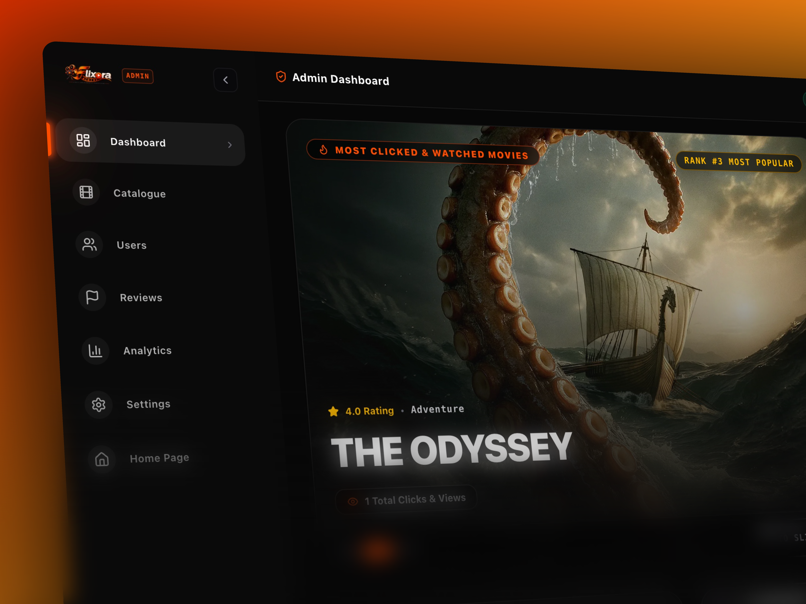

# Flixora - Modern Movie Streaming & Cinema Ticket Booking Platform


**Flixora** is a state-of-the-art, full-stack video streaming platform and multiplex cinema ticket booking web application. Built with Next.js 14 App Router, Express, and MongoDB, Flixora delivers an immersive cinema experience with real-time seat booking, instant Stripe payment processing, AI-powered recommendations, parental controls, and a feature-rich Super Admin Dashboard.

---

## Core Features

### 1. Movie & Anime Catalogue
- Integrated TMDB API for live data on trending movies, popular series, and anime.
- Advanced filtering by genre, rating, release year, and language.

### 2. Interactive Cinema Seat Booking
- Interactive multiplex cinema seat layout with real-time seat selection.
- Automatic price calculation based on seat category and movie session.

### 3. Stripe Payment & Subscription Management
- Secure checkout via Stripe API for subscription plans (Basic, Standard, Premium).
- Instant invoice generation, transaction history, and direct online refunds.

### 4. Parental Control & Kids Mode
- Dedicated PIN-protected Kids profile area with age-appropriate content filters.
- Seamless profile switching between user modes.

### 5. Flixora AI Assistant & Chatbot
- Smart AI chatbot integrated with Gemini AI for movie discovery, recommendations, and assistance.

### 6. Comprehensive Admin Dashboard
- Complete management interface for catalogue, revenue analytics, user accounts, job applications, contact messages, and Stripe refunds.

---

## Screenshots & Previews

### Home Page


### Movie Details & Streaming


### Cinema Seat Selector


### Super Admin Dashboard


---

## Technology Stack

- **Frontend**: Next.js 14 (App Router), React 18, TypeScript, Tailwind CSS, Lucide Icons, Framer Motion
- **Backend**: Node.js, Express.js, Mongoose, Better-Auth / Session Auth
- **Database**: MongoDB Atlas
- **Payments**: Stripe Checkout & Payment Intents API
- **AI & External APIs**: TMDB API, Google Gemini AI, ImgBB API

---

## Getting Started

### 1. Prerequisites
- Node.js `v18+` or `v20+`
- npm, yarn, or pnpm
- MongoDB Atlas Database URI

### 2. Installation & Setup
```bash
# Clone the repository
git clone https://github.com/Zabedfolio/Flixora-Client.git

# Navigate to client directory
cd Flixora-Client

# Install dependencies
npm install

# Start development server
npm run dev
```

### 3. Environment Variables Setup
Create a `.env.local` file in `Flixora-Client` with the following:
```env
NEXT_PUBLIC_SERVER_URL=http://localhost:5000
MONGODB_URI=your_mongodb_connection_string
NEXT_PUBLIC_STRIPE_PUBLISHABLE_KEY=your_stripe_publishable_key
STRIPE_SECRET_KEY=your_stripe_secret_key
IMGBB_API_KEY=your_imgbb_api_key
```

---

## Team Members

We are a team of 6 developers collaborating to build **Flixora**:

| Member | Role | GitHub Profile |
| :--- | :--- | :--- |
| **Zabed Mahmud** | **Team Leader** | [](https://github.com/Zabedfolio) |
| **Anuj Paul** | Core Developer | [](https://github.com/anujpaul27) |
| **Sraboni Sarkar** | Core Developer | [](https://github.com/sraboni47) |
| **Md Sohan** | Core Developer | [](https://github.com/islammdsohan603) |
| **Sheikh Muzammil** | Core Developer | [](https://github.com/sheikh-muzammil2026) |
| **Tahiya Akter** | Core Developer | [](https://github.com/tahiyaakter94) |

---

## License

This project is open source and available under the [MIT License](LICENSE).
